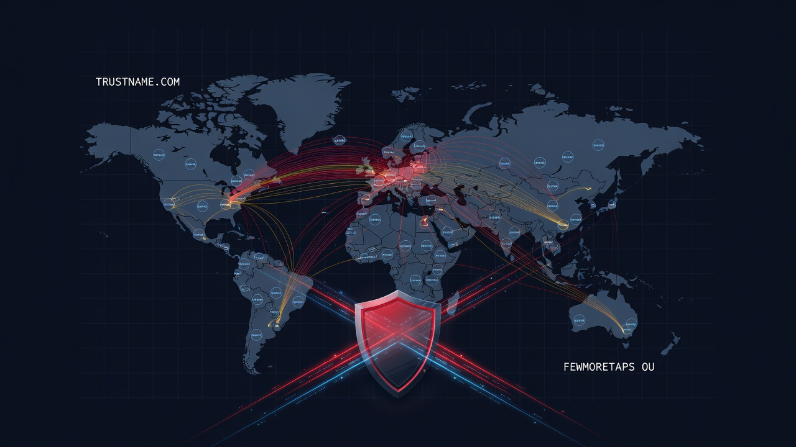

<div align="center">



<br/>

# Trustname.com / Fewmoretaps OÜ
### Registrar Zone Evidence — Phase II

<br/>

[](https://phishdestroy.io/trustname-bulletproof-exposed/)
[](https://www.iana.org/assignments/registrar-ids/registrar-ids.xhtml)
[](https://www.first.org/tlp/)
[](LICENSE)

<br/>

[](#-scope-and-coverage)
[](#-headline-findings)
[](#-headline-findings)
[](#-headline-findings)
[](#-evidence-archive)
[](#-methodology)

<br/>

[](https://phishdestroy.github.io/trustname-evidence)
&nbsp;
[](https://phishdestroy.io/trustname-bulletproof-exposed/)

<br/>


</div>

---

## 📑 Table of Contents

<table>
<tr>
<td valign="top">

**Investigation**
- [1 · Background](#1--background)
- [2 · Subject](#2--subject)
- [3 · Scope and Coverage](#3--scope-and-coverage)
- [4 · Methodology](#4--methodology)

</td>
<td valign="top">

**Evidence**
- [5 · Headline Findings](#-headline-findings)
- [6 · Operator Clusters](#-operator-clusters)
- [7 · Evidence Archive](#-evidence-archive)
- [8 · Notable Confirmed Cases](#-notable-confirmed-cases)

</td>
<td valign="top">

**Legal / Reuse**
- [9 · Enforcement Posture](#-enforcement-posture)
- [10 · Repository Structure](#-repository-structure)
- [11 · Mirrors](#-mirrors-and-long-term-access)
- [12 · Citation & License](#-citation)

</td>
</tr>
</table>

---

## 1 · Background

This repository is the **Phase II evidence package** of the PhishDestroy investigation into **Trustname.com / Fewmoretaps OÜ** (IANA registrar ID **#4318**).

> **Phase I — operator profile and corporate forensics** is published as a standalone article on the PhishDestroy site:
> [📰 phishdestroy.io/trustname-bulletproof-exposed](https://phishdestroy.io/trustname-bulletproof-exposed/)
>
> *This README does not duplicate Phase I material. Refer to the Phase I article for entity, officer, financial, and infrastructure findings.*

**Phase II — this repository — quantifies the abuse footprint by enumerating every domain in the registrar's zone.** Rather than sampling, every domain is processed through a four-stage technical pipeline:

```
       ╭────────────────────╮      ╭────────────────────╮      ╭────────────────────╮      ╭────────────────────╮
       │   1. AWS Lambda    │ ───▶ │  2. Headless       │ ───▶ │  3. CF Deep Scan   │ ───▶ │  4. AI            │
       │   HTTP fingerprint │      │     Browser render │      │     + 2captcha     │      │     classification │
       │   80 conc / inv.   │      │     Playwright     │      │     SOCKS5 pool    │      │     Llama 3.1     │
       ╰────────────────────╯      ╰────────────────────╯      ╰────────────────────╯      ╰────────────────────╯
              7,641                       7,641                       2,182                       2,434
              domains                     domains                     protected targets           classified
```

**Phase II in one sentence:** of the 2,583 domains under this registrar that actually serve content, **2,221 (86 %) are confirmed malicious** — phishing, carding, crypto drainers, malware distribution, illegal-drug sales, and unlicensed gambling. The remaining 5,058 are dead or parked. The complete per-domain dataset, screenshots, and operator-cluster analysis live in this repository.

---

## 2 · Subject

| Field | Value |
|---|---|
| 🏢 Legal entity | **Fewmoretaps OÜ** |
| 🌐 DBA | Trustname.com |
| 🆔 ICANN / IANA ID | **#4318** |
| 🇪🇪 Jurisdiction | Estonia (EU) |

*Operator identity, corporate-registry details, and financial profile are covered in Phase I:*
[phishdestroy.io/trustname-bulletproof-exposed](https://phishdestroy.io/trustname-bulletproof-exposed/)

---

## 3 · Scope and Coverage

<table>
<tr><th>Parameter</th><th>Value</th></tr>
<tr><td>📆 Scan window</td><td>June 2026</td></tr>
<tr><td>📊 Domains in scope</td><td><b>7,641</b> — all domains under registrar management</td></tr>
<tr><td>🎯 Sampling</td><td><b>None</b> — complete-zone enumeration</td></tr>
<tr><td>🌐 Network coverage</td><td>Full HTTP + headless browser for every domain</td></tr>
<tr><td>☁ Cloudflare-protected</td><td>2,072 domains identified in the enriched dataset</td></tr>
<tr><td>🧩 Phase 3 re-scan targets</td><td>2,182 blocked / challenged domains re-scanned via proxy + 2captcha</td></tr>
<tr><td>🧩 CAPTCHAs solved</td><td>92 (hCaptcha · reCAPTCHA v2/v3 · Cloudflare Turnstile)</td></tr>
<tr><td>📷 Screenshots captured</td><td><b>1,953</b></td></tr>
<tr><td>🤖 AI-classified content</td><td>2,434 domains</td></tr>
<tr><td>🛡 Threat-intel feeds</td><td>Spamhaus DBL · SURBL · URLhaus · ThreatFox</td></tr>
</table>

---

## 4 · Methodology

<details open>
<summary><b>🔍 Phase 1 — HTTP Fingerprint (AWS Lambda)</b></summary>

| | |
|---|---|
| **Runtime** | Python 3.11 + `aiohttp`, deployed to AWS Lambda |
| **Concurrency** | 80 requests / invocation × 77 parallel invocations |
| **User-Agent** | Googlebot (cloaking bypass) |
| **`favicon_mmh3`** | MurmurHash3 32-bit of `/favicon.ico` — Shodan-compatible |
| **`server_fp`** | SHA-256 of `server ‖ content-type ‖ x-powered-by` |
| **`simhash`** | 64-bit body SimHash for near-duplicate detection |

</details>

<details>
<summary><b>🖥 Phase 2 — Browser Render (Playwright)</b></summary>

| | |
|---|---|
| **Runtime** | Playwright 1.40 + `playwright-stealth v2`, headless Chromium |
| **Isolation** | new browser context per domain (prevents `TargetClosedError` cascade) |
| **Capture** | Full-page screenshot 1280 × 800, DOM dump, form-field inventory |

**Form-field semantic flags:**
`seed_phrase` · `private_key` · `wallet_addr` · `card_number` · `cvv` · `iban` · `sort_code` · `routing_number` · `password` · `otp_2fa` · `recovery_email` · `ssn` · `passport_number` · `dob`

</details>

<details>
<summary><b>☁ Phase 3 — Cloudflare Deep Scan</b></summary>

| | |
|---|---|
| **Scope** | 2,182 domains returning HTTP 403/503 from Phase 2 |
| **Proxy pool** | 2,600+ rotating SOCKS5 exits |
| **CAPTCHA** | 2captcha API — hCaptcha · reCAPTCHA v2/v3 · Cloudflare Turnstile |
| **Result** | 92 CAPTCHAs solved · **1,953 final screenshots** |

</details>

<details>
<summary><b>🤖 Phase 4 — AI Classification</b></summary>

| | |
|---|---|
| **Model** | `llama-3.1-8b-instant` via Groq API |
| **Input** | `(title, h1, meta_desc, body_text[:2000], form_labels)` |
| **Output** | Natural-language description + category enum + severity score |
| **DNSBL** | Spamhaus DBL · SURBL |
| **REST** | URLhaus · ThreatFox (Abuse.ch) |

</details>

---

## 📊 Headline Findings

<div align="center">

| Metric | Value |
|---|---:|
| 🧮 **Total domains scanned** | **7,641** |
| 💀 Dead / parked / error | 5,058 (66.2 %) |
| 💚 Active with content | 2,583 (33.8 %) |
| 🔴 **HIGH severity** | **1,114** |
| 🟠 **MEDIUM severity** | **1,107** |
| ⚠ **Total malicious (HIGH + MEDIUM)** | **2,221** |
| 🚨 **Malicious share of active content** | **86.0 %** |
| ☁ Behind Cloudflare | 2,072 |
| 📷 Screenshots captured | 1,953 |
| 🧩 CAPTCHAs bypassed | 92 |

</div>

> 🔥 **Of the domains in this registrar's zone that actually serve content, only 1 in 7 is legitimate.**

### Category Breakdown

| | Category | Count | Severity | Description |
|---|---|---:|:---:|---|
| 🎰 | `GAMBLING` | 733 | 🟠 MEDIUM | Unlicensed casino/betting; Turkish *bahis* cluster |
| 🎣 | `PHISHING_GENERIC` | 396 | 🔴 HIGH | Credential harvesting (login, OTP, password) |
| 🏦 | `PHISHING_FINANCE` | 236 | 🔴 HIGH | Bank/card/CVV harvesting |
| 💳 | `CARDING` | 182 | 🔴 HIGH | Clone-card shops, dumps markets, money-mule |
| 🪙 | `PHISHING_CRYPTO` | 178 | 🔴 HIGH | Wallet/exchange phishing (Ledger, Solflare, Pump.fun) |
| 🎭 | `CRYPTO_SCAM` | 146 | 🔴 HIGH | Fake investment platforms, "Elon Musk" casinos |
| ☣ | `MALWARE_DIST` | 105 | 🔴 HIGH | RAT shops, crackware, fake firmware updaters |
| ™ | `BRAND_ABUSE` | 83 | 🟠 MEDIUM | Brand impersonation, typosquatting |
| 🔞 | `ADULT` | 81 | 🟠 MEDIUM | Unlicensed adult content, escort/cams |
| 🚰 | `CRYPTO_DRAIN` | 60 | 🔴 HIGH | Wallet drainers, seed-phrase forms |
| 📨 | `SPAM_INFRA` | 56 | 🟠 MEDIUM | Email/SMS spam infrastructure |
| 🔀 | `PROXY_VPN` | 48 | 🟠 MEDIUM | Proxy / VPN abuse services |
| 💊 | `ILLEGAL_DRUGS` | 42 | 🔴 HIGH | Rx drugs without prescription |
| 🔄 | `CRYPTO_MIXER` | 28 | 🔴 HIGH | Cryptocurrency mixing / laundering |
| 🟢 | `ACTIVE` | 207 | 🟢 LOW | Responds, no confirmed malicious signal |
| 🅿 | `PARKING` | 27 | ⚪ INFO | Parked / for sale |
| ❌ | `ERROR` | 286 | ⚪ INFO | 5xx, connection refused, no content |
| ⚫ | `DEAD` | 4,745 | ⚪ INFO | No DNS / no response |

📄 Full per-domain data: [`data/enriched.csv`](data/enriched.csv)

---

## 🕸 Operator Clusters

Domains grouped by shared **server fingerprint (SHA-256 prefix)** and **favicon MurmurHash3**.
Shared fingerprint = same hosting stack / same operator template — evidence of coordinated infrastructure, not unrelated registrants.

| Cluster Key | Type | Domains | Primary Category |
|---|---|---:|---|
| 🔑 `811e0897f489` | `server_fp` | **1,674** | 🎰 GAMBLING — Turkish *bahis* cluster |
| 🔑 `0ab5f121ab0d` | `server_fp` | 305 | 🎰 GAMBLING — multilingual casino |
| 🔑 `4492f7f3e69c` | `server_fp` | 161 | 💳 CARDING |
| 🔑 `d8c33640a2fc` | `server_fp` | 149 | 💳 CARDING |
| 🔑 `4b8db6e031cc` | `server_fp` | 122 | 🏦 PHISHING_FINANCE — 1xbet typosquats |
| 🔑 `24be2aa9d598` | `server_fp` | 104 | ❌ ERROR (dormant abuse infra) |
| 🖼 `-736095526`   | `favicon_mmh3` | 88 | 🎭 CRYPTO_SCAM — *"Elon" casino cluster* — overlaps Phase I |
| 🖼 `1869784862`   | `favicon_mmh3` | 34 | 🪙 PHISHING_CRYPTO — Solana drainer cluster |
| 🔑 `a1b77bce0100` | `server_fp` | 28 | ☣ MALWARE_DIST — Binance impersonation |

> 🎯 A single server fingerprint `811e0897f489` accounts for **21.9 %** of the entire registrar zone.
> The "Elon" favicon cluster identified here directly extends the six-domain operator group described in Phase I.

Full cluster data: [`case/CLUSTERS.md`](case/CLUSTERS.md)

---

## 📦 Evidence Archive

All artefacts are content-addressed by SHA-256 to support chain-of-custody verification.

| Path | Size | SHA-256 (16) | Contents |
|---|---:|---|---|
| 📊 `data/enriched.csv` | 2.8 MB | `83ea143175d8a378` | Full enriched dataset — all 7,641 domains, all columns |
| 📊 `data/high_severity.csv` | 748 KB | `ecee3b68b2fb34c8` | HIGH-only filtered subset |
| 📊 `data/dead_domains.csv` | 742 KB | `5ee84646c6872591` | Dead / parked / error enumeration |
| 🚫 `ioc/domains_high.txt` | 19 KB | `ec9e43c15ff3cffc` | Production blocklist — 1,114 HIGH domains |
| 🚫 `ioc/domains_all_malicious.txt` | 39 KB | `d27809c1a099c019` | HIGH + MEDIUM blocklist — 2,221 domains |
| 🛡 `ioc/indicators.csv` | 775 KB | `4e9dcd3840be9f9a` | SIEM indicators — IP, server_fp, favicon_mmh3, category, severity |
| 🔐 `evidence/HASHES.txt` | 168 KB | `131ff258bd0c058c` | SHA-256 of all 1,953 screenshots |
| 📦 `pkg/raw_data/enriched.csv.gz` | 560 KB | `a2a6f5fda9f364aa` | Compressed enriched dataset |
| 📦 `pkg/raw_data/lambda_results.jsonl.gz` | 509 KB | `c0add17921efada8` | Phase 1 — HTTP fingerprint raw output |
| 📦 `pkg/raw_data/deep_results.jsonl.gz` | 1.1 MB | `60b943f03e7ac926` | Phase 2/3 — browser render raw output |
| 📦 `pkg/raw_data/threat_intel.jsonl.gz` | 74 KB | `4a92dafe955b60d4` | Threat-intel cross-reference |

📋 Detailed chain-of-custody documentation: [`PROVENANCE.md`](PROVENANCE.md)

### 🔍 Verification

```bash
# verify any archive
sha256sum pkg/raw_data/enriched.csv.gz
# expected prefix: a2a6f5fda9f364aa…

# verify all 1,953 screenshots against the manifest
cd docs/screenshots && sha256sum -c ../../evidence/HASHES.txt
```

---

## 🎯 Notable Confirmed Cases

| Domain | Category | Evidence |
|---|---|---|
| 💳 `buyclonecards.bond` | CARDING | Explicit clone-card shop, CVV dumps market |
| ☣ `thebtmob.com` | MALWARE_DIST | Active BT-MOB RAT shop, malware-as-a-service |
| 🚰 `fragapi.com` | CRYPTO_DRAIN | Seed-phrase harvesting form (browser-confirmed) |
| 🚰 `instasolana.bond` | CRYPTO_DRAIN | Solana wallet drainer, 1,674-domain shared infra |
| 🪙 `purnp-fun.com` | PHISHING_CRYPTO | Fake Pump.fun / Solflare phishing page |
| ☣ `kmspico.zip` | MALWARE_DIST | Malware under crack/keygen disguise |
| 💳 `rollmaneycontrol.bond` | CARDING | Money-mule / fund-transfer fraud |

Full per-domain narrative: [`case/HIGH_SEVERITY.md`](case/HIGH_SEVERITY.md)

---

## ⚖ Enforcement Posture

> This report is structured as an evidence package for **criminal and financial-intelligence agencies**, not as an ICANN compliance filing.

ICANN's mandate is technical stability of the DNS, not fraud policing. The Registrar Accreditation Agreement is a contract; an RAA §3.18 violation is a breach of contract, not a crime. Accreditation revocation is an administrative process measured in years.

Fewmoretaps OÜ collects registration revenue from operators conducting wire fraud, credential theft, carding, and cryptocurrency theft — establishing a knowing position in the criminal money flow. **Criminal liability does not require ICANN action as a prerequisite.**

| Agency | Jurisdictional Basis |
|---|---|
| 🇪🇪 **Politsei- ja Piirivalveamet** | Primary registration jurisdiction · EU AML Directive |
| 🇪🇪 **CERT-EE / RIA** | National CERT · cybercrime reporting authority |
| 🇪🇺 **Europol EC3** | Cross-border cybercrime coordination · iForce referrals |
| 🇺🇸 **FBI IC3** | Wire fraud (18 U.S.C. §1343), CFAA — US victims |
| 🇺🇸 **FinCEN** | Money-services business violations · USD flow tracing |

---

## 📂 Repository Structure

```
trustname-evidence/
├── 📊 docs/                                 GitHub Pages site
│   ├── index.html                          Executive report — metrics, charts, gallery
│   ├── domains.html                        Searchable per-domain table (7,641)
│   ├── data.json                           Slim dataset for the live report
│   ├── build_datajson.py                   Generator: enriched.csv → data.json
│   ├── sitemap.xml / robots.txt / .nojekyll
│   └── screenshots/                        Local mirror; ignored by git, publish via S3/Git LFS
├── 📁 data/                                 Source datasets
│   ├── enriched.csv                        Full per-domain dataset
│   ├── high_severity.csv                   HIGH-only filtered subset
│   └── dead_domains.csv                    Dead / parked enumeration
├── 🚫 ioc/                                  Indicators of Compromise
│   ├── domains_high.txt                    1,114 HIGH blocklist
│   ├── domains_all_malicious.txt           2,221 HIGH + MEDIUM blocklist
│   └── indicators.csv                      SIEM-ready
├── 🔐 evidence/
│   ├── screenshots/                        Local screenshot archive; ignored by git
│   └── HASHES.txt                          SHA-256 manifest
├── 📄 case/                                 Narrative reports
│   ├── INVESTIGATION.md
│   ├── HIGH_SEVERITY.md
│   └── CLUSTERS.md
├── 📦 pkg/raw_data/                         Compressed raw scan output
│   ├── enriched.csv.gz
│   ├── lambda_results.jsonl.gz
│   ├── deep_results.jsonl.gz
│   └── threat_intel.jsonl.gz
├── 🔧 .github/workflows/pages.yml           Auto-build & deploy
├── 📄 PROVENANCE.md                         Chain of custody
├── 📄 VERIFY.md                             Hash verification and release signing
├── 📄 NOTICE.md                             TLP:CLEAR and evidence-use notice
├── 📄 CITATION.cff                          Citation metadata
├── 🔐 SHA256SUMS.txt                        Repository SHA-256 manifest
├── 📜 LICENSE                               MIT
└── 📖 README.md
```

---

## 🌐 PhishDestroy

[](https://phishdestroy.io/)
[](https://phishdestroy.io/trustname-bulletproof-exposed/)
[](https://phishdestroy.github.io/trustname-evidence/)

**PhishDestroy** is an independent anti-phishing and anti-fraud research project. Our work includes:

- **Domain abuse detection at scale** — complete-zone scans of accused-bulletproof registrars, real-time IOC feed publication, infrastructure clustering
- **Operator attribution** — corporate-registry forensics, payment-rail tracing, fake-review forensics, infrastructure mapping
- **Public evidence packages** — TLP:CLEAR, MIT-licensed, formatted for ICANN compliance, law-enforcement intake, and academic citation

> 🌐 Main site & research index: **[phishdestroy.io](https://phishdestroy.io/)**
> 📚 Investigation archive: **[phishdestroy.io/articles](https://phishdestroy.io/)**
> 🐙 Code & datasets: **[github.com/phishdestroy](https://github.com/phishdestroy)**

## 🌐 Mirrors and Long-Term Access

| Channel | Identifier |
|---|---|
| 🐙 GitHub | [`phishdestroy/trustname-evidence`](https://github.com/phishdestroy/trustname-evidence) |
| 🌐 GitHub Pages | [`phishdestroy.github.io/trustname-evidence`](https://phishdestroy.github.io/trustname-evidence) |
| 📰 PhishDestroy publication | [`phishdestroy.io/trustname-bulletproof-exposed`](https://phishdestroy.io/trustname-bulletproof-exposed/) |
| 🌐 PhishDestroy main site | [`phishdestroy.io`](https://phishdestroy.io/) |
| ⏳ Wayback Machine | snapshot pinned on publication |

---

## 📚 Citation

```bibtex
@misc{phishdestroy_trustname_2026,
  author       = {PhishDestroy Research},
  title        = {Fewmoretaps O\"U / Trustname.com --- Registrar Zone Evidence
                  (Phase II of the Trustname Investigation)},
  year         = 2026,
  month        = jun,
  howpublished = {GitHub},
  url          = {https://github.com/phishdestroy/trustname-evidence}
}
```

Plain text:

```
PhishDestroy. (2026). Fewmoretaps OÜ / Trustname.com — Registrar Zone Evidence
(Phase II of the Trustname investigation). GitHub.
https://github.com/phishdestroy/trustname-evidence
```

---

## ⚖ License and Use

| | |
|---|---|
| 📜 License | **MIT** — see [`LICENSE`](LICENSE) |
| 🏷 TLP | **CLEAR** — public sharing permitted |
| 🤝 Sharing | Researchers, journalists, and law-enforcement officers are welcome to use this dataset; attribution is appreciated but not required |
| 🌐 Contact | [phishdestroy.io](https://phishdestroy.io) |

Evidence-use notice: [`NOTICE.md`](NOTICE.md). Verification and release-signing instructions: [`VERIFY.md`](VERIFY.md).

---

## 🔗 Related Investigations

[-6ea8d7?style=for-the-badge&logo=github&logoColor=white&labelColor=0c1018)](https://github.com/phishdestroy/namesilo-evidence)

---

<div align="center">


**PhishDestroy Research** · Phase II · June 2026 · TLP:CLEAR

</div>
